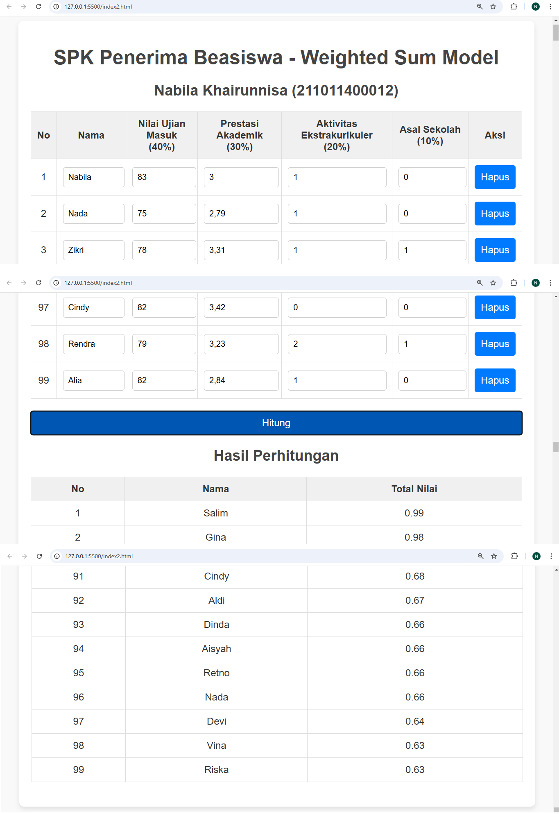

# Sistem Pendukung Keputusan Penerima Beasiswa - Weighted Sum Model

Aplikasi ini adalah implementasi dari Sistem Pendukung Keputusan (SPK) untuk menentukan penerima beasiswa menggunakan metode Weighted Sum Model (WSM). Aplikasi ini dibangun menggunakan HTML, CSS, dan JavaScript.

## Fitur Utama
- **Input Data Otomatis:** Sistem akan mengisi data dengan nilai random untuk 100 nama siswa sebagai contoh.
- **Kriteria Penilaian:**
  - Nilai Ujian Masuk (40%)
  - Prestasi Akademik (30%)
  - Aktivitas Ekstrakurikuler (20%)
  - Asal Sekolah (10%)
- **Hapus Baris:** Anda dapat menghapus baris data input secara manual.
- **Perhitungan Normalisasi:** Menggunakan bobot kriteria untuk menghitung total nilai setiap siswa berdasarkan normalisasi data.
- **Tabel Hasil:** Menampilkan hasil perhitungan yang diurutkan berdasarkan total nilai dari yang tertinggi ke terendah.

## Teknologi yang Digunakan
- **Frontend:**
  - HTML5
  - CSS3
  - JavaScript

## Cara Menggunakan
1. Clone repository ini:
   ```bash
   git clone [<repository-url>](https://github.com/nabilaakhairunnisa/spk-penerima-beasiswa)
   ```
2. Buka file `index.html` di browser Anda.
3. Sistem akan otomatis menampilkan tabel dengan 99 data siswa.
4. Tekan tombol "Hitung" untuk memproses data dan menampilkan hasil di tabel "Hasil Perhitungan".
5. Anda dapat menghapus baris data yang tidak diperlukan dengan menekan tombol "Hapus" di kolom aksi.

## Struktur File
- **index.html:** File utama yang berisi struktur HTML.
- **style.css:** File CSS untuk mengatur tampilan.
- **script:** Script JavaScript untuk mengelola logika SPK.

---

### Demo


